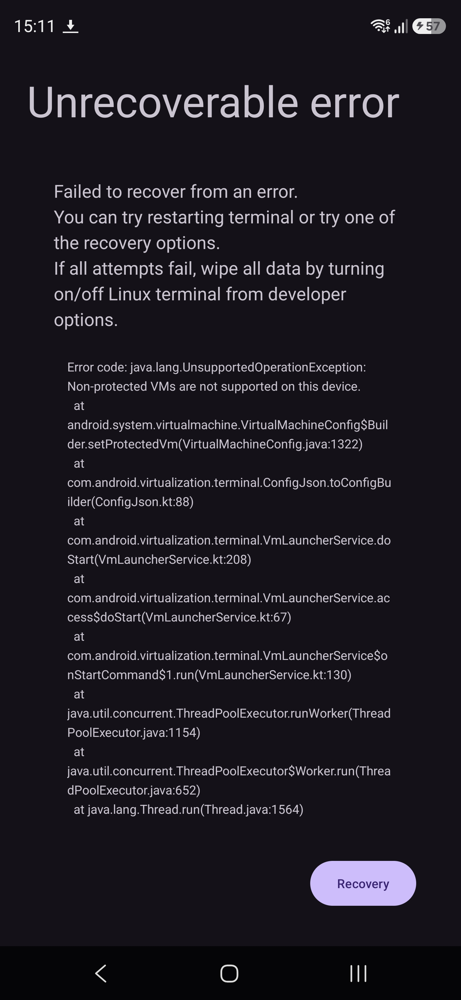

## Introduction

I purchased the [Samsung S26 Ultra](https://www.samsung.com/uk/smartphones/galaxy-s26-ultra/). I was hoping to able to play around with the Android Terminal application but it is hidden in One UI 8.5 for whatever reason, and that reasons I suspect is because [non-protected VMs](https://www.reddit.com/r/AndroidQuestions/comments/1s5ongh/samsung_s26_ultra_enabling_nonprotected_vms_for/) are not yet supported on the Snapdragon 8 Elite Gen 5 for Galaxy chip that powers the Samsung S26 Ultra.

## Steps

1. Turn on `Developer options`. Google this, if you don't know how to.
1. Enable `USB debugging` in `Developer options`.
1. Install `adb`.
1. Connect phone to device.
1. You might have to run `adb reconnect` at this point, once you've done that make sure that `adb devices -l` lists your device. You will most likely receive a prompt on your phone asking you trust this device.
1. Get a shell using `adb shell`.
1. Run `adb shell pm enable com.android.virtualization.terminal` or `adb shell cmd package enable com.android.virtualization.terminal`[^1], you should see `Package com.android.virtualization.terminal new state: enabled` as the output.
1. Launch `Terminal` application and click install. Although this enables the Android Linux Terminal application, it still isn't functional as can be seen from the screenshot below:

I guess we have to wait until Samsung/Qualcomm "fix" this. I've created a post, <https://us.community.samsung.com/t5/Galaxy-S26/Samsung-S26-Ultra-How-to-enable-non-protected-VMS-for-Android/m-p/3542388#M10731>, over at Samsung's forum. Hopefully we'll hear from them shortly.

[^1]: <https://xdaforums.com/t/xperia-1-vii-android-16-enable-linux-terminaldesktop-freeform-windowing.4765734/>.
