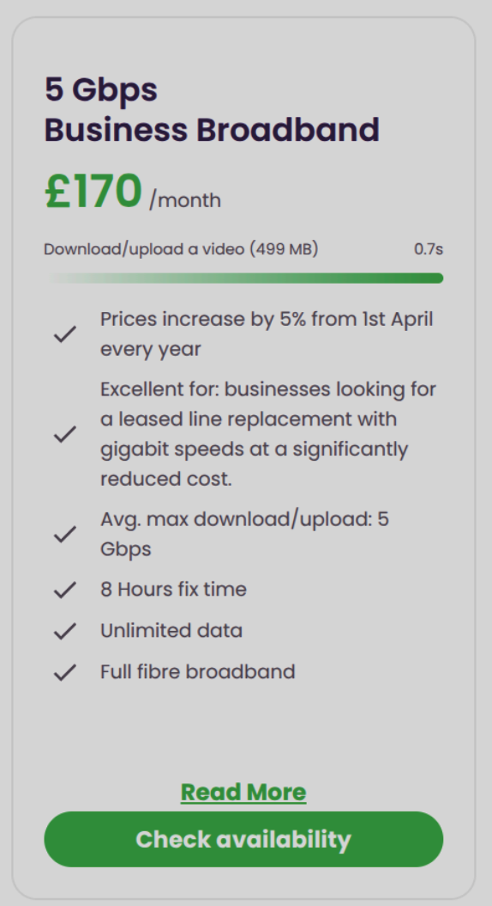
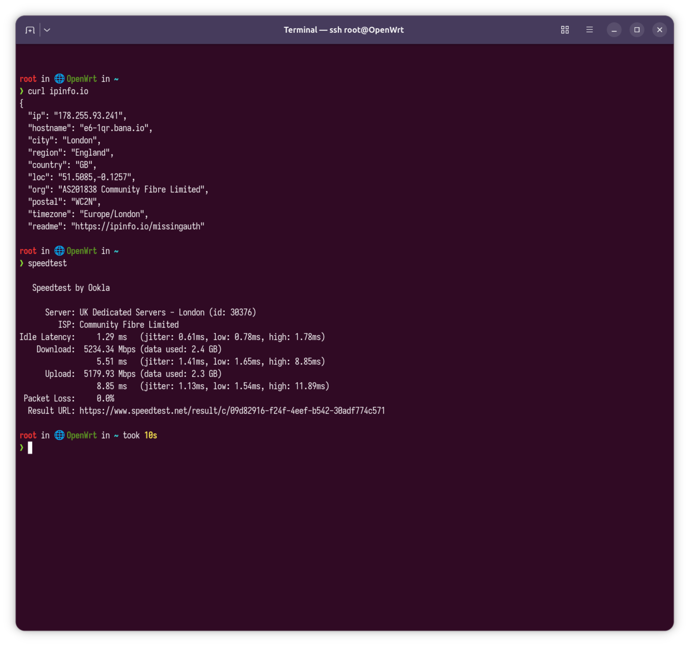

## Introduction

This is a contiuation of [Community Fibre: How to get an extra ~123Mbps increase in download and upload speed](../community-fibre-how-to-get-an-extra-~123mbps-increase-in-download-and-upload-speed).

First thing’s first, big shout out to Community Fibre for providing me with (a business plan) 5 Gbps package. Superb team and support! 10/10 so far. The average speed is advertised as 5 Gbps.




## XGSPON ONU Stick SFP+ Compatible 8311 Firmware

1. <https://www.alibaba.com/product-detail/Yunvo-10G-1270-1577nm-SC-APC_1601269313920.html?spm=a2756.trade-list-buyer.0.0.289276e9cUto8z>: **This is the one I currently use** along with the [Banana Pi BPI-R4 Pro 4E](../banana-pi-bpi-r4-pro-4e). It costs $64.00 along with shipping to the United Kingdom.
2. <https://www.amazon.co.uk/dp/B0F2TBB4TD?ref=ppx_yo2ov_dt_b_fed_asin_title>, which I believe is effectively this, <https://www.fibermall.com/sale-462134-xgspon-onu-sfp-stick-i-temp.htm>: I don’t like the pricing on it but the instructions, in all fairness, are good.
3. <https://store.betterinternet.ltd/product/x-onu-sfpp>: Great pricing but instructions could/should be as good as the one below by FiberMall. Although in all fairness Better Internet do offer to put in your ONT serial for so you don’t have to mess around with the configuration GUI.

See [^1] [^2] and [^3] for further information.

## Results

Using the official speedtest cli taken from <https://www.speedtest.net/apps/cli>:

```sh
wget 'https://install.speedtest.net/app/cli/ookla-speedtest-1.2.0-linux-aarch64.tgz'
tar -vxzf ./ookla-speedtest-1.2.0-linux-aarch64.tgz
```

I ran the binary **directly** on the router (therefore bypassing NAT etc.) and the results [^4] below speak for themselves:

```sh
root in 🌐 OpenWrt in ~ 
❯ curl ipinfo.io
{
  "ip": "178.255.93.241",
  "hostname": "e6-1qr.bana.io",
  "city": "London",
  "region": "England",
  "country": "GB",
  "loc": "51.5085,-0.1257",
  "org": "AS201838 Community Fibre Limited",
  "postal": "WC2N",
  "timezone": "Europe/London",
  "readme": "https://ipinfo.io/missingauth"

root in 🌐 OpenWrt in ~ 
❯ speedtest 

   Speedtest by Ookla

      Server: UK Dedicated Servers - London (id: 30376)
         ISP: Community Fibre Limited
Idle Latency:     1.29 ms   (jitter: 0.61ms, low: 0.78ms, high: 1.78ms)
    Download:  5234.34 Mbps (data used: 2.4 GB)                                                   
                  5.51 ms   (jitter: 1.41ms, low: 1.65ms, high: 8.85ms)
      Upload:  5179.93 Mbps (data used: 2.3 GB)                                                   
                  8.85 ms   (jitter: 1.13ms, low: 1.54ms, high: 11.89ms)
 Packet Loss:     0.0%
  Result URL: https://www.speedtest.net/result/c/09d82916-f24f-4eef-b542-30adf774c571

```

So it looks like I am hitting above average speeds, maybe because Community Fibre overprovision? Not sure ... if you work at Community Fibre, please do email me at m@bana.io if you know why I get higher than average speeds.



[^1]: [8311 Community Firmware MOD](https://github.com/djGrrr/8311-was-110-firmware-builder) by [djGrrr](https://github.com/djGrrr).
[^2]: [8311 Community Discord Server](https://discord.com/servers/8311-886329492438671420).
[^3]: [https://pon.wiki/](https://pon.wiki/).
[^4]: <https://www.speedtest.net/result/c/09d82916-f24f-4eef-b542-30adf774c571>.
