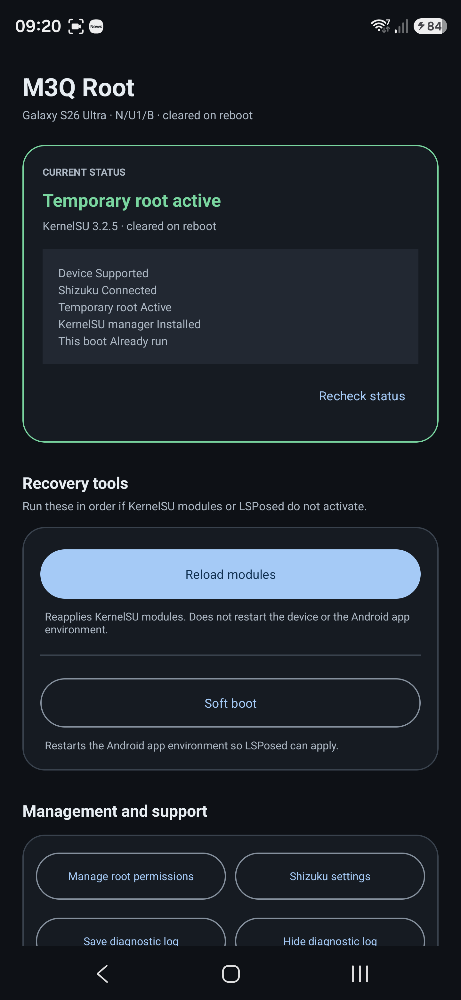
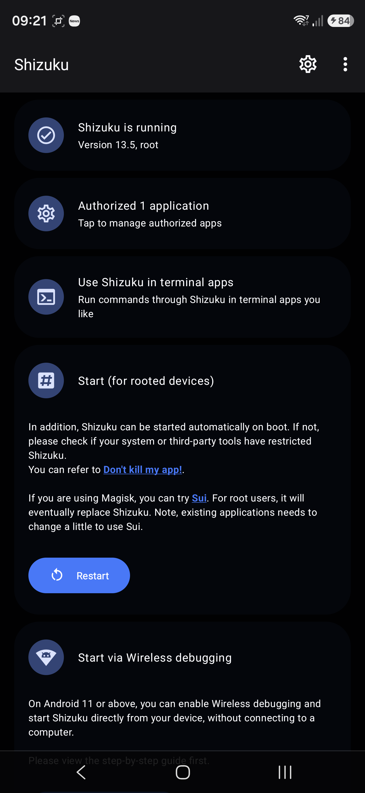
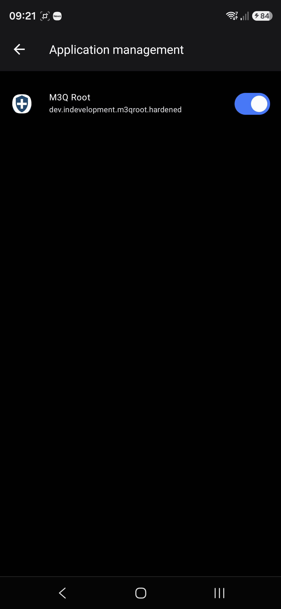
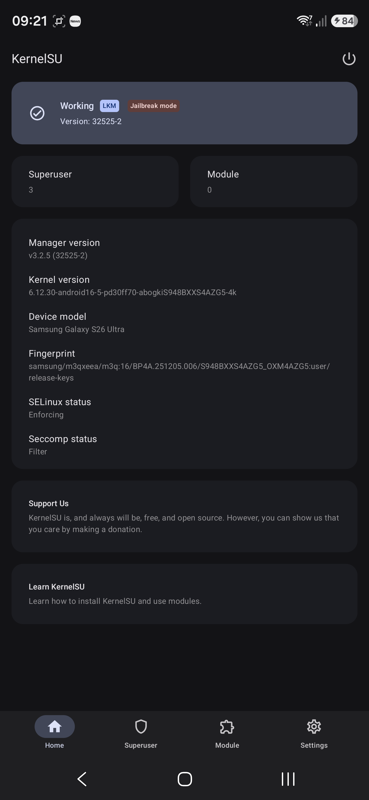
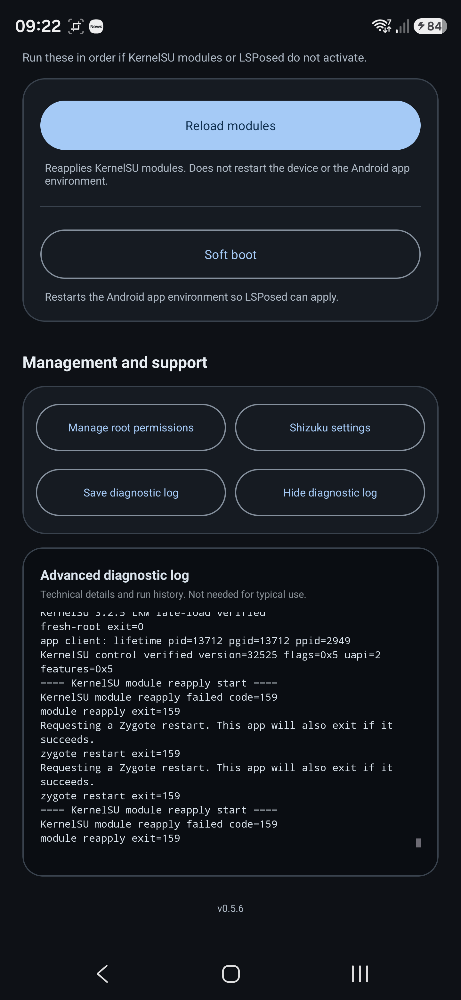
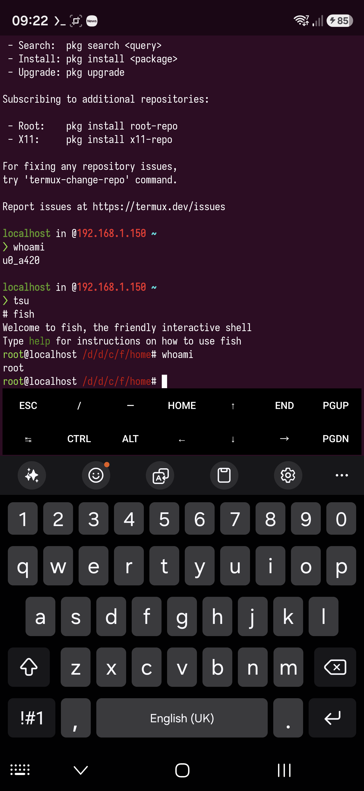

## Introduction

**WIP:** Place-holder blog post which I will complete in due course.

Getting `root` on newer Samsung devices is no longer easy since Samsung have removed the option to unlock the bootloader, however there are ways around this.

## Device details

Ensure you have the same firmware and kernel version to ensure a higher chance of the exploit suceeding.

### Firmware

```
Android 16
Released: 7/2/2026

PDA: S948BXXS4AZG5
CSC: S948BOXM4AZG5
Country: EEA (Europe)
Region: EUX

Upload date: 7/2/2026
Package size: 22.5 GB (24177658339 bytes)
File name: EUX-S948BXXS4AZG5-20260702135802.zip
```

Download available at <https://www.sammobile.com/samsung/galaxy-s26-ultra/firmware/SM-S948B/EUX/download/S948BXXS4AZG5/1996077/> or using <https://samloader.com/>:

```sh
$ mkdir -pv SM-S948B/firmware
$ cd SM-S948B/firmware
$ wget -qO- 'https://github.com/topjohnwu/samloader-rs/releases/download/2.1.0/samloader-v2.1.0-linux-x86_64.zip' | bsdtar -xvf- -C .
$ chmod -v +x ./samloader
$ ./samloader download --model 'SM-S948B' --region 'EUX' --version 'S948BXXS4AZG5/S948BOXM4AZG5/S948BXXS4AZG5'
```

You should find `SM-S948B_1_20260702135802_gcoaqtp276_fac.zip` in the current working directory.

Unzip it, then you should find `AP_S948BXXS4AZG5_S948BXXS4AZG5_MQB111616901_REV00_user_low_ship_MULTI_CERT_meta_OS16.tar.md5`. After extracting that, you should find a file `AP_S948BXXS4AZG5_S948BXXS4AZG5_MQB111616901_REV00_user_low_ship_MULTI_CERT_meta_OS16/init_boot.img.lz4` which is required for KernelSU, that is unless you want to use the `init_boot.img` I have supplied.

### Kernel

```sh
Build: BP4A.251205.006.S948BXXS4AZG5
Build fingerprint: 'samsung/m3qxeea/m3q:16/BP4A.251205.006/S948BXXS4AZG5_OXM4AZG5:user/release-keys'
Bootloader: S948BXXS4AZG5
Radio: S948BXXS4AZG5,S948BXXS4AZG5
Network: ,O2 - UK
Module Metadata version: 371559000
Android SDK version: 36
SDK extensions: [ad_services=22, b=22, c=<not set>, r=22, s=22, t=22, u=22, v=22]
Kernel: Linux version 6.12.30-android16-5-pd30ff70-abogkiS948BXXS4AZG5-4k (kleaf@build-host) (Android (14043575, +pgo, +bolt, +lto, +mlgo, based on r536225) clang version 19.0.1 (https://android.googlesource.com/toolchain/llvm-project b3a530ec6537146650e42be89f1089e9a3588460), LLD 19.0.1) #1 SMP PREEMPT Thu Jul  2 00:16:21 UTC 2026
```

## Mandatory photos and video

<iframe id="ytplayer" type="text/html" width="640" height="360"
  src="https://www.youtube.com/embed/RyRu12gSeBE?autoplay=1&origin=https://blog.bana.io"
  frameborder="1"></iframe>








## Quick Guide on becoming `root`

### Files

1. [`shizuku-v13.6.0.r1086.2650830c-release.apk`](./files/shizuku-v13.6.0.r1086.2650830c-release.apk)
2. [`M3Q-EU.apk`](./files/M3Q-EU.apk)
3. [`android16-6.12_kernelsu.ko`](./files/android16-6.12_kernelsu.ko)
4. [`KernelSU_v3.2.5_32525-release.apk`](./files/KernelSU_v3.2.5_32525-release.apk)
5. [`init_boot.img`](./files/init_boot.img)
6. [`init_boot.img.lz4`](./files/init_boot.img.lz4)

### Steps

1. Install `shizuku-v13.6.0.r1086.2650830c-release.apk`, then follow the instructions to enable it. The easiest way is to plug your phone into a computer and use `adb`.
2. Install `KernelSU_v3.2.5_32525-release.apk`, the version used is important here. I would suggest you stick to using this version.
3. Install `M3Q-EU.apk` and ensure you have given permissions to it via `Shizuku`. This was obtained from <https://xdaforums.com/t/i-released-a-temporary-kernelsu-root-launcher-for-the-korean-galaxy-s26-ultra-sm-s948n-azg3-firmware.4798629/post-90708430>.


## Exploration

If you have `termux` installed, it would be wise to also install the `tsu` package, see <https://github.com/cswl/tsu> and <https://github.com/termux/termux-root-packages>:

```sh
$ pkg install -y root-repo
$ pkg install -y tsu
$ tsu
# <all_installed_termux_packages_are_available_to_use>
```

Yes, I know ... these are deprecated/archived so one should not really use them.

## The details

See [^1] [^2] [^3] [^4] [^5] [^6] and [^7]

Thanks for reading and good luck.

[^1]: <https://nebusec.ai/research/ionstack-part-1-cve-2026-10702/>.
[^2]: <https://nebusec.ai/research/ionstack-part-2/>.
[^3]: <https://nebusec.ai/research/ionstack-part-3/>.
[^4]: <https://nebusec.ai/buglist/CVE-2026-43499/>.
[^5]: <https://github.com/NebuSec/CyberMeowfia/tree/main/IonStack/CVE-2026-43499>: See the `exploit` and `poc` directories. I think this only applies to Google Pixel devices at the time of writing this.
[^6]: <https://github.com/BuSung-dev/Root-My-Galaxy-Payloads>: The above but ported to Samsung phones.
[^7]: <https://github.com/monovibe/s26u-m3q-temp-root>: The above but ported to Samsung phones.
