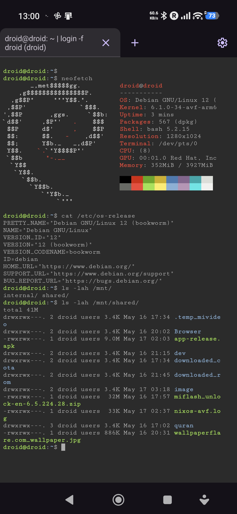
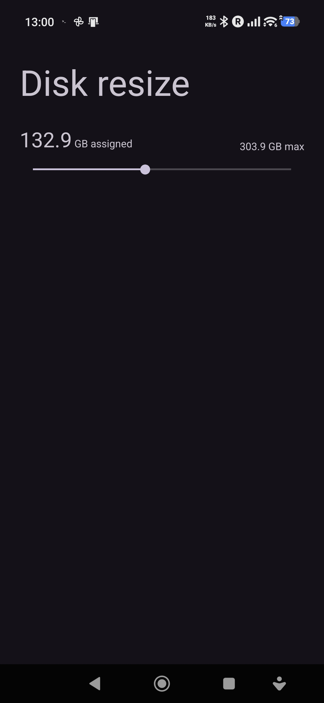
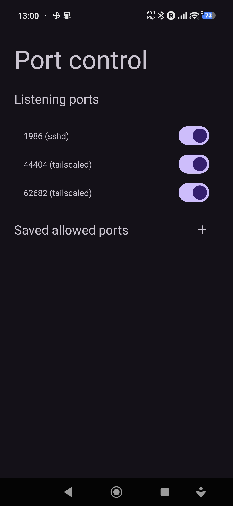

## Introduction

I purchased the [POCO X8 PRO MAX](https://www.amazon.co.uk/dp/B0GHN3P6X1?ref=ppx_yo2ov_dt_b_fed_asin_title&th=1) so I could play around with AVF.

## Steps

### Host

On the host, that is, the device running the quest VM run:

```sh
# Add Terminal app to deviceidle whitelist (prevents doze killing)
adb shell cmd deviceidle whitelist +com.android.virtualization.terminal
# Set app standby bucket to active (prevents Android from deprioritizing)
adb shell am set-standby-bucket com.android.virtualization.terminal active
# Grant background run permissions
adb shell cmd appops set com.android.virtualization.terminal RUN_IN_BACKGROUND allow
adb shell cmd appops set com.android.virtualization.terminal RUN_ANY_IN_BACKGROUND allow
# Exempt from power restrictions
adb shell cmd appops set com.android.virtualization.terminal SYSTEM_EXEMPT_FROM_POWER_RESTRICTIONS allow
```

### Guest

In the Android Linux Terminal application increase the size of the disk allocated to the VM to something reasonable, then run the below replacing `TAILSCALE_KEY` with an actual key obtained from the Tailscale admin console, `SSH_PUBLIC_KEY` with your SSH public key and `SSH_PRIVATE_KEY` with your SSH private key:

```sh
sudo su <<'EOF'
hostnamectl hostname droid
# This is probably not needed
useradd --groups "$(groups droid | perl -pe 's/.*?: \S+ //; s/ /,/g')"  --create-home mbana
echo "root:droid" | chpasswd
echo "droid:droid" | chpasswd
echo "mbana:droid" | chpasswd
echo 'droid ALL=(ALL) NOPASSWD:ALL' | tee -a /etc/sudoers.d/100-droid
# Again this probably not needed
echo 'mbana ALL=(ALL) NOPASSWD:ALL' | tee -a /etc/sudoers.d/100-mbana
apt update -y
dpkg --configure -a
apt upgrade -y
dpkg --configure -a
apt install -y openssh-server vim zsh sed coreutils curl git nmap net-tools neofetch screenfetch
sed -i 's/#Port 22/Port 1986/' /etc/ssh/sshd_config
sed -i 's/^PasswordAuthentication .*/PasswordAuthentication yes/' /etc/ssh/sshd_config
echo 'PermitRootLogin yes' >> /etc/ssh/sshd_config
systemctl enable ssh
systemctl restart --now ssh
curl -fsSL https://tailscale.com/install.sh | sh
tailscale up --auth-key='TAILSCALE_KEY' --accept-dns=false --hostname=droid --ssh
exit
EOF
mkdir -v -m700 ~/.ssh
# Replace with your public key.
echo 'SSH_PUBLIC_KEY' | tee -a ~/.ssh/id_ed25519.pub | tee -a ~/.ssh/authorized_keys
# Replace with your private key
cat <<EOF | tee -a ~/.ssh/id_ed25519
SSH_PRIVATE_KEY
EOF
eval "$(ssh-agent)"
chmod -v 600 ~/.ssh/id_ed25519
chmod -v 644 ~/.ssh/authorized_keys ~/.ssh/id_ed25519.pub
chmod -v 700 ~/.ssh
ssh-add ~/.ssh/id_ed25519
echo 'Rebooting VM in 8 seconds'
sudo neofetch
sudo netstat -tulpn
sudo tailscale status
sleep 8s
```

The above does many things but most notable are:

1. It installs Tailscale, so we can SSH into the VM on local network.
2. Install OpenSSH and makes it use port 1986 instead of the default 22.
3. Sets the hostname to `droid` so that on another machine - that has Tailscale installed - the command `ssh -p 1986 droid@droid` just works.

### Screenshots

#### Final result

**Note:** You are able to access the host device at `/mnt/shared`.



#### Disk resize



#### Assigned ports



## Stay tuned

More to come.